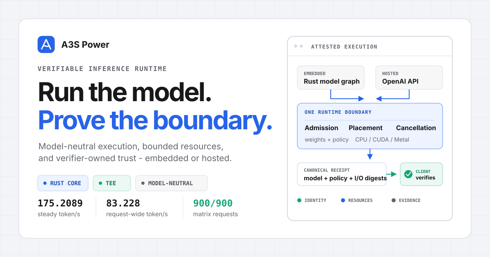

# A3S Power

<p align="center">
  <a href="https://a3s-lab.github.io/Power/"></a>
</p>

<p align="center">
  
</p>

<p align="center">
  <strong>A model-neutral Rust runtime for bounded, verifiable inference - embedded or OpenAI-compatible.</strong>
</p>

<p align="center">
  <a href="https://github.com/A3S-Lab/Power/actions/workflows/ci.yml"></a>
  <a href="https://github.com/A3S-Lab/Power/actions/workflows/pages.yml"></a>
  <a href="https://a3s-lab.github.io/Power/"></a>
  <a href="https://a3s-lab.github.io/Power/en/"></a>
  <a href="https://crates.io/crates/a3s-power"></a>
  <a href="https://docs.rs/a3s-power"></a>
  <a href="LICENSE"></a>
</p>

<p align="center">
  <a href="#why-power-exists">First principles</a> &middot;
  <a href="#measured-boundary">Measured boundary</a> &middot;
  <a href="#start-in-three-steps">Quick start</a> &middot;
  <a href="#one-core-three-surfaces">Architecture</a> &middot;
  <a href="#verification-is-a-client-decision">Verification</a> &middot;
  <a href="https://a3s-lab.github.io/Power/">Documentation</a>
</p>

A3S Power makes inference infrastructure explicit. Model repositories keep
ownership of topology, tokenization, preprocessing, state semantics, and quality
policy. Power owns the execution boundary around them: devices, admission,
placement, cancellation, artifact integrity, privacy, and evidence.

That separation supports a listener-free Rust library, an optional hosted
service, and a safe artifact provisioner without hiding model behavior behind a
second model abstraction.

## Why Power exists

Start from three constraints:

| First principle | Engineering consequence | Power mechanism |
| --- | --- | --- |
| Inference consumes finite memory, compute, queue, and transfer capacity. | Every request must enter through explicit limits and remain cancellable; adjacent graph calls should not bounce unchanged tensors through host memory. | Bounded admission, deterministic microbatching, model-owned finite shape profiles, aggregate resident-tensor budgets, placement plans, session pools, and cancellation-safe queues. |
| A model name does not identify the bytes or policy that produced an answer. | Execution identity must bind artifacts, runtime policy, device path, input, and output. | SHA-256 identities, verified mirrors, accelerator evidence, and canonical receipts. |
| The server operator cannot be the root of trust for its own claims. | Acceptance policy belongs to the client or verifier. | Nonce-bound CPU TEE reports, optional confidential-GPU claims, RA-TLS, and an independent verifier CLI. |

The shared runtime is deliberately model-neutral: Power contains no product
model assets, and its execution contracts do not dispatch on language, vision,
OCR, embedding, or any other model family. Architecture-specific adapters may
live behind those contracts without changing the core scheduler or verifier.

## Measured boundary

Power publishes machine-readable captures from its real streaming API, not only
a standalone llama.cpp microbenchmark.

The Qwen3.8 table below is one pinned backend/model/hardware integration, not
the scope of the engine. Power's public runtime, graph, scheduling, memory,
copy-cost, and evidence contracts do not branch on Qwen or any model family;
language, vision, OCR, embedding, and multimodal crates retain their own
topology and semantics.

| Qwen3.8-27B artifact and mode | Fixed-task quality proxy | Mean request-wide throughput | Median steady decode |
| --- | --- | ---: | ---: |
| Untouched Q6_K, autoregressive | 67/100 lenient; 60/100 strict (100 tasks, 3x) | 30.883 token/s | 35.5793 token/s (earlier capture) |
| **Untouched Q6_K + prefix-FR8192, fixed K6/S6, B8** | 9/12 lenient and strict in both paired modes (1x; 3 truncated) | **46.923 token/s** | - |
| **Untouched Q6_K + prefix-FR8192, fixed K7/S6, B11, high-priority CUDA** | Fixed peak prompt retained the control digest | - | **172.835 token/s** on a contended desktop |
| Untouched Q6_K, full-vocabulary MTP, K7/S7 | Fixed peak prompt has exact greedy parity | - | 147.0207 token/s |
| Untouched Q6_K, full-vocabulary MTP, K7/S6 | 5/12 lenient; 3/12 strict (1x calibration; 11 truncated) | **47.032 token/s** | - |
| **Untouched Q6_K + prefix-FR8192 MTP, K7/S6** | 4/12 lenient; 3/12 strict (1x calibration; 11 truncated) | 37.290 token/s | **176.6109 token/s** |
| TBQ4 mixed, autoregressive | 70/100 lenient; 64/100 strict (100 tasks, 3x) | 38.724 token/s | - |
| **TBQ4 mixed + full-vocabulary fixed MTP, K7/S7** | **76/100 lenient; 66/100 strict** (100 tasks, 3x) | **83.228 token/s** | **175.2089 token/s** |
| TBQ4 mixed + full-vocabulary guarded MTP, K7/S6 | 5/12 lenient; 3/12 strict (12 tasks, 3x) | 54.060 token/s | **177.7165 token/s** |
| TBQ4 mixed + MTP + prefix FR (historical) | 72/100 lenient; 60/100 strict (100 tasks, 3x) | 27.951 token/s | 184.3665 token/s |
| UD-Q8_K_XL, heterogeneous MTP K4/S4 | Cross-mode output hashes differ; matrix not run | - | 9.7577 token/s |

The current untouched 22,884,408,288-byte Q6_K artifact sustained a 176.6109
token/s median across nine 1,024-token samples, with a 173.2630 minimum and
seven samples at or above 175. Prefix-FR8192 improved steady decode by 20.13%
over its 147.0207 token/s full-vocabulary K7/S7 control, and both emitted the
same deterministic output digest. No model weight was requantized.

The 2026-08-22 execution-only follow-up kept those exact bytes and separated
two workload shapes. The peak K7/S6/B11 profile disables Flash Attention only
for short-batch decode and uses high-priority CUDA streams; its clean nine-run
capture reached 172.835 token/s median and 171.298 minimum while the Windows
display GPU already had 5--8% background utilization. The mixed-task K6/S6/B8
profile reached 46.923 token/s versus a paired 28.713 token/s target-only
control, a 63.42% gain, with
the same 12 final answers, the same 9/12 score, and zero replay. CUDA graphs are
essential: disabling them fell to 133.876 token/s on the peak workload.

That capture crosses 175 as a median boundary; it does **not** establish a
175 token/s service floor because two samples were below it. New acceptance
runs can independently require the median and every measured sample, and the
generic GGUF runner can require a configurable pre-start quiet window and
retains an input-bound preflight receipt when the idle-GPU ceiling is exceeded.
On this shared Windows display GPU, exclusive scheduling is part of the
requirement, not an inference flag.

That FR profile is a long, high-coverage peak, **not** a universal default or a
service floor. On the one-pass 12-task calibration, full-vocabulary K7/S6
reached 47.032 token/s request-wide with 52.30% proposal acceptance, while
prefix-FR8192 reached 37.290 token/s with 24.82% acceptance. Eleven tasks per
mode hit the 128-token cap, so this calibration diagnoses workload sensitivity;
the repeated 100-task matrix remains the primary quality evidence.

The earlier mixed-artifact K7/S7 profile sustained a 175.2089 token/s median
and completed all 900 requests in its repeated quality matrix with 51.33%
proposal acceptance and no replay. That separate 19,187,686,464-byte artifact
uses Q4_0 main FFN tensors, a Q6_K MTP block, and a Q4_K draft head. Both
boundaries depend on full CUDA offload, stable batched target/draft graphs,
host controls, and exact target verification. Flash Attention is profile-
specific: retained for long contexts and disabled only where the
measured hybrid short-batch kernel mix is faster without it.

The quality values are task-accuracy proxies, not general intelligence or IQ
measurements. On the fixed current matrix, K7/S7 moved from 70 to 76 lenient and
64 to 66 strict answers versus TBQ4 autoregressive mode, so no regression was
observed in that sample. The paired comparison did not reach conventional
statistical significance and is not evidence that MTP improves intelligence.

The lossless prefix-cache path was measured separately with the unchanged
Q6_K model, target-only decoding, and Flash Attention enabled. Five fresh
cold/warm pairs reduced median backend prefill from 786.1375 ms to 33.4102 ms
(23.5299x) and median TTFT from 950.0142 ms to 72.1932 ms (13.1593x), while
reusing 9,740 prompt tokens. This is repeated-context latency evidence, not a
steady-decode or DFlash/DSpark claim.

- [Current Q6_K/TBQ4/MTP benchmark, raw samples, and limitations](docs/benchmarks/qwen3.8-27b-q6k-rtx4090/README.md)
- [Q6_K prefix-cache cold/warm capture and exact reproduction](docs/benchmarks/qwen3.8-27b-q6k-rtx4090/prompt-cache/README.md)
- [Untouched-Q6_K 176.61 token/s boundary and dynamic-quantization analysis](docs/benchmarks/qwen3.8-27b-q6k-rtx4090/PURE-Q6.md)
- [Repeated quality matrix and reproducible environment](docs/benchmarks/qwen3.8-27b-q6k-rtx4090/quality/README.md)
- [Step-by-step reproduction guide](docs/benchmarks/qwen3.8-27b-q6k-rtx4090/REPRODUCE.md)
- [UD-Q8_K_XL heterogeneous-placement boundary](docs/benchmarks/qwen3.8-27b-ud-q8-k-xl-rtx4090/README.md)

## Start in three steps

### 1. Choose the boundary

Use the embedded runtime when your crate owns the model graph. Use the hosted
service when clients need an OpenAI-compatible network API. Both paths reuse the
same integrity, resource, and evidence contracts.

### 2. Embed the model-neutral runtime

```toml
[dependencies]
a3s-power = { version = "1.0.0", default-features = false, features = ["embedded-inference"] }
```

```rust
use a3s_power::inference::{DevicePreference, EmbeddedRuntime, InferenceLimits};

fn main() -> Result<(), a3s_power::error::PowerError> {
    let runtime = EmbeddedRuntime::new(
        DevicePreference::Auto,
        InferenceLimits::default(),
    )?;

    println!("execution device: {}", runtime.device().name());
    Ok(())
}
```

The caller supplies a reviewed model plan and retains semantic state. Power
supplies the bounded execution boundary and evidence contracts; constructing the
embedded runtime never opens a listener or downloads a model.

### 3. Host only when the product needs a service

```bash
cargo install a3s-power
a3s-power serve --host 127.0.0.1 --port 11434
```

In another terminal:

```bash
a3s-power models pull Qwen/Qwen2.5-0.5B-Instruct-GGUF:q4_k_m
a3s-power chat Qwen/Qwen2.5-0.5B-Instruct-GGUF:q4_k_m
```

Models and content-addressed blobs live under `~/.a3s/power` by default. Set
`A3S_POWER_HOME` to move the store.

## One core, three surfaces

```text
revision-locked bundle       model-owned graph       API client
          |                         |                     |
    provisioner                 embedded               service
          \                         |                    /
           +----------- shared runtime core -----------+
                                  |
              admission / placement / cancellation
                                  |
                    devices / weights / state
                                  |
                   evidence / canonical receipt
                                  |
                      independent verification
```

| Surface | Use it when | Network behavior |
| --- | --- | --- |
| **Artifact provisioner** | A product owns a revision-locked bundle and needs safe first-use installation. | Policy-gated download; verified artifacts are reusable offline. |
| **Embedded runtime** | A model crate owns its graph and needs shared execution, placement, state, and evidence. | No listener, model hub, or child process. |
| **Hosted service** | Clients need chat, completions, embeddings, lifecycle, metrics, and attestation. | Explicit HTTP, RA-TLS, or vsock transport. |
| **Minimal TEE service** | A constrained enclave needs a pure-Rust, layer-streaming GGUF path. | Transport remains an explicit feature choice. |

### Responsibility boundary

| Power owns | Model-owning crates own |
| --- | --- |
| Typed CPU, CUDA, and Metal devices; bounded graph execution and opaque resident-tensor boundaries | Architecture, topology, layers, kernels, and arithmetic |
| Admission, session pools, microbatching, cancellation, and limits | Tokenizer, preprocessing, postprocessing, and generation policy |
| Artifact identity, mirrors, placement, and residency | Asset revisions, conversion, tensor contracts, and quality gates |
| TEE privacy, attestation binding, sealed state, and receipts | KV/recurrent layout and semantic state |

Read the [embedded inference architecture](docs/embedded-inference-architecture.md)
for the complete contract model.

### Finite profiles do not give Power model semantics

A model crate may publish up to 256 opaque, digest-bound shape classes for
reviewed optimized implementations. Power checks only aggregate batch,
tensor-element, scratch, device-topology, artifact, and TEE-policy bounds. The
model still chooses what a class means and how an input maps to it. Missing or
oversized classes either fail or use an explicitly digest-bound dynamic
implementation; receipt v5 records the path and reason without dimensions or
class data. See [Model-Owned Shape Profiles](docs/shape-profiles.md).

### Mutable replicas do not give Power model semantics

Stateful backends may request up to 256 lazy, independently initialized replicas
for one exact model/execution identity. Every replica is held by a non-cloneable
lease, but all replicas reuse one resolved runtime and one physical-device
admission gate. Power reserves the declared per-replica resident bytes for the
entire configured replica set before invoking a loader, so concurrency cannot
silently overcommit memory.

The family string is opaque identity, not a dispatch key: language decoders,
vision encoders, OCR graphs, embedding models, and multimodal pipelines use the
same pool. The loader receives no replica ordinal or model-family switch, and
snapshots contain only aggregate counts. Cancellation or future drop returns
the lease and removes a never-initialized empty entry. Optional monotonic
deadlines cover the complete model/device admission path without serializing
wall-clock time; the typed expiry maps to HTTP 408 at the hosted boundary
and increments only content-free aggregate counters. A model crate can consume
an exclusive lease with `retire()` after it determines that mutable state is no
longer reusable; Power replaces that anonymous generation before releasing the
slot and reconstructs it lazily without changing the declaration identity. See
[Model-Neutral Session Replicas](docs/session-replicas.md).

### Resident graph chains do not give Power a model architecture

`GraphExecutor::run_to_resident` can keep one reviewed graph output on the
resolved runtime device, and `run_resident` can consume it in the next reviewed
graph under the same request permit. The opaque `ResidentGraphTensor` is
non-cloneable, F32-only, exact-shape checked, bound to one runtime/device, and
charged to a shared aggregate byte budget derived from `max_tensor_elements`.
It contains no tokenizer, layer, attention, image, OCR, or model-family switch.

The first owned tensor is hashed before upload. `materialize` performs the one
final owned output copy, rechecks cancellation, and returns both canonical v1
tensor digests plus aggregate boundary counts. Incompatible runtimes never
trigger an implicit copy: materialize explicitly, move the owned output through
`TensorOutput::into_input`, and acquire the target permit afterward. See
[Device-Resident Reviewed Graph Chains](docs/device-resident-graphs.md).

### The release gate verifies contracts, not model names

`ReleaseEvidenceBundle` applies one fail-closed policy to named-hardware
captures. The strict v1 policy requires distinct CPU, CUDA, Metal, and
confidential-GPU evidence; a local CUDA report cannot be reused as the
confidential capture. Every capture must replay exact scalar/batch parity and
prove bounded host/device peak memory, active-work cancellation cleanup, queue
deadline expiry, replica retirement and reconstruction, and an explicit exact
fallback.

The policy separates identities that can be shared honestly from those that
cannot. Power revision, weights, and reviewed graph are common; each platform
binds its own finite shape-profile declaration and TEE policy because device
topology and memory reservations differ. The exact runtime executable remains
capture-specific, and confidential GPU claims are required where applicable.

Local captures can be constructed only with the local security class. A
confidential capture must pass the fixed
`verify_confidential_gpu_attestation` profile and carry its opaque,
exact-report proof into `ReleaseCapture::promote_confidential_gpu`; raw reports,
deserialized labels, and caller-authored verification booleans cannot mint that
class. The resulting digest-bound capture is still evidence, not authorship, so
the release system must authenticate its bundle digest.

For v1, the confidential binding is explicitly SEV-SNP-only. The release
workflow requires a tag to identify an evidence-only child of the frozen source
commit, bounded-reads its checked-in four-platform bundle, verifies the external
SHA-256 pin plus exact crate version and source commit, and builds release
binaries from that parent. This avoids self-referential commit identity and
blocks every non-`0.x` tag when evidence is missing, mixed with source changes,
not reachable from `main`, carried by a lightweight or unverified tag, or
TDX-backed. Strict construction also rejects Metal captures that do not name a
native Apple Silicon/macOS host or that disclose virtual, emulated, translated,
fallback, software-rendered, or unnamed hardware; hosted paravirtual Metal is
preflight evidence, not production evidence. See the
[v1 Production Support Matrix](docs/v1-support-matrix.md).

`a3s-power-tensor-batch-bench release-run` applies the same collector to any
caller-owned reviewed graph, typed tensors, opaque profile identities, and
independent reference output. `release-fixture` is only a reproducible Add-graph
calibration path. Its persistent cross-host weights are created with
`materialize-release-fixture-weights`; `release-confidential-fixture` then
writes a local CUDA source plus active residency declaration as a validated
create-new pair. `verify-release-capture` independently bounded-reads a received
capture, recomputes its canonical digest, and checks its exact platform,
version, and source revision before bundle assembly; its receipt explicitly
states that the strict four-platform bundle is still required. SafeTensors
startup pins, attestation, embedded execution, and
accelerator declarations share one canonical collection digest. Neither the
collector nor the evidence schema contains a
tokenizer, container format, generation mode, model family, or architecture
dispatch key. Qwen is one possible workload; language, vision, embedding,
audio, scientific, and custom graphs use the same contract. See
[Production Release Evidence Gate](docs/release-evidence-gate.md). The
[external hardware capture guide](docs/external-release-capture.md) defines the
real Metal run and nonce-bound confidential-GPU promotion without introducing a
Qwen-, GGUF-, or backend-specific release path.

## Backends are capabilities, not architecture

| Feature | Role | Native dependency |
| --- | --- | --- |
| `mistralrs` | Default Candle-based GGUF, SafeTensors, vision, and embedding backend | No C++ inference engine |
| `llamacpp` | Mature GGUF backend with native MTP support | CMake, C++ compiler, and libclang |
| `llamacpp-cuda` | CUDA execution for llama.cpp | CUDA toolkit |
| `llamacpp-mtp-fr` | Experimental reduced-vocabulary MTP draft projection | Reviewed patch to the pinned llama.cpp source |
| `picolm` | Pure-Rust layer-streaming GGUF backend for constrained TEE memory | No C/C++ inference engine |
| `embedded-cuda` / `embedded-metal` | Accelerators for model-owned embedded graphs | Platform toolkit |
| `tls` / `vsock` | RA-TLS and A3S Box guest-host transports | Platform-specific |
| `hw-verify` | AMD SEV-SNP signature verification; Intel TDX fails closed pending DCAP Quote/QVL support | Platform crypto dependencies and AMD KDS access |

Cargo resolves the pinned optional Git dependencies before feature selection.
On Windows, enable Git's long-path support once before the first build so the
pinned llama.cpp source can be checked out intact:

```powershell
git config --global core.longpaths true
```

```bash
# Default hosted service
cargo build --locked --release

# Listener-free embedded runtime
cargo build --locked --release --no-default-features --features embedded-inference

# Pure-Rust layer-streaming TEE service
cargo build --locked --release --no-default-features --features tee-minimal

# llama.cpp with CUDA
cargo build --locked --release --no-default-features --features llamacpp-cuda

# Strict verifier plus model-neutral confidential release promotion
cargo build --locked --release --no-default-features \
  --features server,embedded-inference,hw-verify \
  --bin a3s-power-verify
```

The FR-Spec-inspired path is separate because it patches the pinned llama.cpp
source. Follow the reviewed procedure in
[Model-neutral Speculative Decoding](docs/speculative-decoding.md); ordinary
`llamacpp` builds do not need that patch.

## Speculation remains exact

Power exposes model-neutral strategy selection, capability negotiation,
adaptive draft lengths, exact target verification, rollback, and metrics.
Backends advertise support; an explicitly requested unsupported strategy fails
closed.

Available strategies are `off`, `prompt-lookup`, `ngram-context`, `draft-model`,
`mtp`, `dflash`, and `dspark`; `auto` selects a backend-supported default.

```acl
spec_mode = "mtp"
spec_draft_max = 7
spec_mtp_recurrent_snapshots = 7

# Experimental compact draft projection. Omit for full vocabulary.
# spec_mtp_fr_vocab_size = 8192
```

K7/S7 keeps a resident rollback point for every proposal and is the balanced
mixed-workload profile. Reduced-vocabulary FR changes only the draft head, but
its acceptance is domain- and language-sensitive. The current quality-gated
profile therefore uses full-vocabulary drafting.

## Configure policy with ACL

The service reads `~/.a3s/power/config.acl`, or the path supplied to
`a3s-power serve --config`.

```acl
host = "127.0.0.1"
port = 11434
max_loaded_models = 1
prompt_cache_max_entries = 1
prompt_cache_ttl_seconds = 300
keep_alive = "5m"

flash_attention = true
num_parallel = 1

gpu {
  gpu_layers = -1
  main_gpu = 0
}
```

TEE deployments add verifier-owned pins and strict policy:

```acl
tee_mode = true
tee_policy_mode = "strict"
redact_logs = true

expected_measurement "sev-snp" {
  digest = "<96-character measurement hex>"
}

model_hash "your-model" {
  digest = "sha256:<64-character artifact digest>"
}
```

Invalid ACL, ranges, strategies, hashes, or unsupported explicit backends fail
before inference. Strict mode rejects simulated attestation.

## OpenAI-compatible API

| Method | Endpoint | Purpose |
| --- | --- | --- |
| `GET` | `/health` | Readiness, loaded models, backend capabilities, and TEE status |
| `POST` | `/v1/chat/completions` | Chat, tools, structured output, vision, and SSE streaming |
| `POST` | `/v1/completions` | Text completion and SSE streaming |
| `POST` | `/v1/embeddings` | Embedding inference |
| `GET` | `/v1/models` | Registered models |
| `POST` | `/v1/models/pull` | Resumable ModelScope or Hugging Face pull |
| `GET` | `/v1/attestation` | Nonce- and model-bound TEE evidence |
| `GET` | `/metrics` | Prometheus metrics |

```bash
curl http://127.0.0.1:11434/v1/chat/completions \
  -H "Content-Type: application/json" \
  -d '{
    "model": "your-model",
    "messages": [{"role": "user", "content": "Explain capability-based security."}],
    "prompt_cache_key": "shared-agent-prefix-v1",
    "stream": true
  }'
```

Chat and completion responses include an `attestation_receipt` and its SHA-256
digest. Streaming responses emit the receipt before `[DONE]`.

`prompt_cache_key` is an explicit A3S extension. The llama.cpp text path reuses
a token prefix only when its KV and recurrent state can roll back exactly;
unsupported backends return
`prompt_cache_unsupported` instead of ignoring the field. Power scopes the key
by authenticated identity, endpoint, and model, bounds resident contexts by
LRU capacity and TTL, exposes hit/miss/token/eviction metrics, and binds only a
key digest into the request receipt. Native MTP and cached llama.cpp sessions
do not compose yet; explicit MTP fails closed and `auto` chooses target-only
decoding for keyed requests. See [Keyed Prompt-Prefix Cache](docs/prompt-prefix-cache.md).

## Verification is a client decision

```text
model bytes + runtime policy
             |
             v
canonical claims digest + fresh nonce
             |
             v
CPU TEE report + optional GPU evidence
             |
             v
request, effective prompt, and output receipt
             |
             v
independent client verifier accepts or rejects
```

```bash
a3s-power-verify \
  --url http://127.0.0.1:11434 \
  --nonce <client-nonce-hex> \
  --model-hash <artifact-sha256-hex> \
  --expected-measurement <launch-measurement-hex>
```

The verifier selects acceptable launch measurements, artifact hashes, runtime
policy, GPU evidence, and receipt fields. The server does not get to weaken
those conditions.

Power verifies AMD SEV-SNP signatures, binds policy-visible fields to the exact
signed raw report, and checks nonce freshness, canonical model/runtime claims,
RA-TLS binding, request/response digests, and optional NVIDIA GPU/NVSwitch
topology and NRAS verdicts. Intel TDX currently emits a local TDREPORT and fails
strict verification until a reviewed DCAP Quote/QVL path exists. See
[Hardware Verifier Operations](docs/hardware-verifier-operations.md) for the
current production boundary and failure policy.

### Security boundaries

- Simulated TEE mode is development-only and fails strict verification.
- CPU TEE placement does not make GPU offload confidential; use verified
  `gpu-confidential` policy.
- Effective-prompt digests exist only for deterministic text paths. Opaque
  renderer paths leave the claim absent instead of fabricating it.
- Mixed quantization and reduced-vocabulary FR are experimental performance
  techniques, not universal quality guarantees.

## Documentation

| Guide | Scope |
| --- | --- |
| [Documentation home - 简体中文](https://a3s-lab.github.io/Power/) | Default `next` documentation in Simplified Chinese |
| [Documentation home - English](https://a3s-lab.github.io/Power/en/) | English `next` documentation |
| [v1.0.0 release documentation](https://a3s-lab.github.io/Power/v1.0.0/) | Versioned bilingual production-release snapshot |
| [v0.9.0 release documentation](https://a3s-lab.github.io/Power/v0.9.0/) | Versioned bilingual release snapshot |
| [Optimization playbook](docs/optimization-playbook.md) | Complete model-neutral map of graph, tensor, speculation, scheduling, storage, residency, accelerator, and evidence techniques |
| [Embedded Inference Architecture](docs/embedded-inference-architecture.md) | Graph execution, placement, scheduling, state, and receipts |
| [Model-Owned Shape Profiles](docs/shape-profiles.md) | Finite opaque classes, stale-binding rejection, fallback, and receipt v5 |
| [Model-Neutral Session Replicas](docs/session-replicas.md) | Exclusive mutable contexts, shared device admission, residency bounds, and cancellation |
| [Device-Resident Reviewed Graph Chains](docs/device-resident-graphs.md) | Same-request opaque handles, exact boundary validation, digest continuity, and explicit owned fallback |
| [Production Release Evidence Gate](docs/release-evidence-gate.md) | Strict platform coverage, immutable bindings, runtime failure proofs, and trust-root requirements |
| [v1 Production Support Matrix](docs/v1-support-matrix.md) | Required execution platforms, SEV-SNP boundary, TDX exclusion, and the machine-enforced release artifact contract |
| [External Metal and Confidential-GPU Capture](docs/external-release-capture.md) | Clean-revision hardware commands, raw vendor evidence, strict proof-backed promotion, and artifact inventory |
| [Model-neutral Speculative Decoding](docs/speculative-decoding.md) | Strategies, native MTP, patching, protocol, and acceptance |
| [Keyed Prompt-Prefix Cache](docs/prompt-prefix-cache.md) | Explicit API contract, tenant isolation, bounded KV lifecycle, metrics, MTP boundary, and paired cold/warm benchmark |
| [Qwen3.8-27B Q6_K benchmark](docs/benchmarks/qwen3.8-27b-q6k-rtx4090/README.md) | Performance gates, artifact identity, quality, and raw evidence |
| [Reproduction guide](docs/benchmarks/qwen3.8-27b-q6k-rtx4090/REPRODUCE.md) | CUDA build, pinned inputs, replay, audit, and validation |
| [Hardware Verifier Operations](docs/hardware-verifier-operations.md) | Production hardware-signature verification |
| [Supply-chain Audit](docs/supply-chain.md) | Feature profiles, native code, and threat model |
| [Storage Benchmark](docs/storage-benchmark.md) | Verified storage and residency measurements |
| [Tensor Batch Cost Benchmark](docs/tensor-batch-benchmark.md) | Model-neutral allocation, host-boundary copy cost, parity, and named-hardware reproduction |
| [Windows CPU/CUDA complete contract captures](docs/benchmarks/release-contract-windows-20260821/README.md) | Clean-revision peak memory, cancellation, queue expiry, replica recovery, fallback parity, raw JSON, and exact reproduction |
| [Windows CPU/CUDA P5 pre-captures](docs/benchmarks/release-gate-windows-20260821/README.md) | Clean-revision raw samples, hashes, negative evidence, reproduction, and explicit remaining gaps |
| [Roadmap](ROADMAP.md) | Acceptance gates and remaining work |
| [Changelog](CHANGELOG.md) | Released behavior |

Rust API documentation is published at
[docs.rs/a3s-power](https://docs.rs/a3s-power).

## Development

Run checks from this crate rather than the monorepo root:

```bash
cargo fmt --all -- --check
cargo test --locked --lib
cargo test --locked --no-default-features --features embedded-inference --lib
cargo test --locked --no-default-features --features picolm --lib
cargo clippy --locked --all-targets -- -D warnings

npm ci --prefix site
npm run typecheck --prefix site
npm run build --prefix site
npm run check:site --prefix site
```

CI validates formatting, Clippy feature matrices, tests, the listener-free
embedded boundary, release targets, and the GitHub Pages artifact.

## A3S ecosystem

| Project | Relationship |
| --- | --- |
| [A3S Box](https://github.com/A3S-Lab/Box) | Hosts Power inside SEV-SNP or TDX MicroVMs |
| [A3S Gateway](https://github.com/A3S-Lab/Gateway) | Routes inference traffic |
| [A3S Runtime](https://github.com/A3S-Lab/Runtime) | Supplies deployment-unit contracts |
| [A3S Code](https://github.com/A3S-Lab/Code) | Consumes local inference and verified bundles |
| [A3S Event](https://github.com/A3S-Lab/Event) | Distributes platform events |

Questions and design discussions are welcome on
[Discord](https://discord.gg/XVg6Hu6H).

## License

[MIT](LICENSE)
